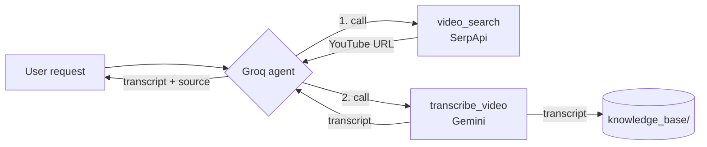

# Video Search + Transcription Agent

**By Shuja Jamal** (AI Internship, Spiral Labs)

A tool-calling AI agent that finds a YouTube video and transcribes it. The agent runs on Groq and is given two tools: one that searches for videos with SerpApi, and one that transcribes them with Gemini. The agent decides when to call each.


---

## What it does

Given a request like *"find and transcribe a video about how photosynthesis works"*, the agent:

1. Calls **`video_search`** → SerpApi returns a YouTube URL and metadata.
2. Calls **`transcribe_video`** with that URL → Gemini transcribes the video, and the transcript is saved to the knowledge base.
3. Replies with the transcript and the **source URL**.



Three services, each with a distinct job:

| Component | Service | Role |
| :--- | :--- | :--- |
| **Agent / orchestration** | Groq (`openai/gpt-oss-120b`) | Decides which tool to call and when, via tool calling |
| **Tool 1: `video_search`** | SerpApi (YouTube engine) | Finds a video, returns its URL |
| **Tool 2: `transcribe_video`** | Gemini (`gemini-flash-latest`) | Transcribes the video, saves the transcript |
| **Knowledge base** | Local files | Every transcript saved with its source and model |

---

## The transcription rule

The task requires that the agent **transcribes with the tool and never writes the transcript itself**, and that it **cites the source video** at the end, so that tool use is verifiable. Both are enforced in two places:

- **The system prompt** ([`agent.py`](agent.py)) tells the model it has not watched the video, that the transcript must come from `transcribe_video`, and that every reply must end with a `Source:` line.
- **The code** only ever produces a transcript by calling Gemini inside `transcribe_video`. There is no path by which the agent can emit transcript text without a real tool call, and the run prints the exact sequence of tools it used.

After any run, `agent.used_tools_in_order()` returns the tools that actually executed, for example `['video_search', 'transcribe_video']`. If that list is empty, no tools ran.

---

## Setup

**1. Get three free API keys:**

| Key | From |
| :--- | :--- |
| `GROQ_API_KEY` | [console.groq.com/keys](https://console.groq.com/keys) |
| `SERPAPI_API_KEY` | [serpapi.com/manage-api-key](https://serpapi.com/manage-api-key) |
| `GEMINI_API_KEY` | [aistudio.google.com/apikey](https://aistudio.google.com/apikey) |

**2. Install and configure:**

```bash
git clone https://github.com/<username>/<repo>.git
cd <repo>

python -m venv .venv
.venv\Scripts\activate          # Windows
# source .venv/bin/activate     # macOS or Linux

pip install -r requirements.txt

copy .env.example .env          # Windows  (cp on macOS/Linux)
# then edit .env and paste in your three keys
```

`.env` is gitignored, so your keys never leave your machine.

**3. Run it:**

```bash
python agent.py "find and transcribe a short video about black holes"
```

or with no argument to be prompted:

```bash
python agent.py
```

The agent prints each tool call as it happens, then the transcript, the source, and the tool sequence it used. The transcript is also saved under [`knowledge_base/`](knowledge_base/).

---

## Example run

```
Request: find and transcribe a short video about black holes

  -> video_search(query='black holes explained short')
  -> transcribe_video(video_url='https://www.youtube.com/watch?v=...', title='Black Holes Explained')
     saved 4821 chars to knowledge_base/20260722-143012_black-holes-explained.md

======================================================================
[the verbatim transcript returned by Gemini]

Source: https://www.youtube.com/watch?v=...
======================================================================

Tools used (in order): video_search -> transcribe_video
```

---

## Tests

```bash
python tests/test_agent.py
```

No API keys needed. The Groq client and both network calls are replaced with fakes, so the tests exercise the real orchestration: that the agent calls both tools **in the right order**, feeds the search URL into the transcription step, saves the transcript with its source, cites the source in the final answer, and surfaces tool failures instead of inventing content.

---

## Project structure

```
.
├── agent.py                    The agent: Groq tool-calling loop and system prompt
├── tools.py                    VideoSearchTool (SerpApi) and TranscriptionTool (Gemini)
├── requirements.txt            groq, google-genai, requests, python-dotenv
├── .env.example                template for the three API keys
├── .gitignore                  excludes .env, the venv and saved transcripts
├── knowledge_base/             saved transcripts land here
│   └── sample_transcript.md    shows the saved-file format
├── tests/
│   └── test_agent.py           offline orchestration tests
└── README.md
```

---

## Design notes

**Why Groq for the agent and Gemini for transcription?** They play to different strengths. Groq's tool calling is fast and OpenAI-compatible, which suits an orchestration loop that may take several turns. Gemini accepts a YouTube URL directly and transcribes the video natively, so the transcription tool needs no download step. Using both is also what the task's tech stack calls for.

**Why `openai/gpt-oss-120b` and `parallel_tool_calls=False`?** The agent was first built on `llama-3.3-70b-versatile`, which had two problems on Groq: it intermittently emitted a malformed tool-call format that Groq's validator rejected outright, and it tended to request both tools in a single turn. The second is worse than it sounds, because `transcribe_video` needs the URL that `video_search` returns, so calling them together means transcribing a guessed URL. `openai/gpt-oss-120b` emits well-formed calls reliably, and `parallel_tool_calls=False` forces one tool per turn, so search always completes and hands its real URL to transcription.

**Why `gemini-flash-latest` rather than a pinned version?** A pinned model such as `gemini-2.5-flash` eventually stops accepting new API keys, which surfaces as a `404 ... no longer available to new users` at transcription time. The `-latest` alias always resolves to the current Flash model, so the tool keeps working as Google rolls versions forward. Any specific version can still be forced with the `GEMINI_MODEL` variable.

**Why call SerpApi over plain HTTP instead of an SDK?** The endpoint is a single documented GET request, and going direct with `requests` avoids depending on an SDK whose versions and import paths have changed over time. Fewer moving parts, and the request is easy to read.

**Why does the transcription tool, not the agent, save the file?** Saving where the transcript is produced guarantees that every transcript reaching the knowledge base is a real tool output with its source attached. The agent cannot save something it invented, because it never holds transcript text that did not come from the tool.

**Transient errors are retried.** Gemini occasionally returns `503` (high demand) or `429` (rate limit). These are temporary, so the transcription tool retries them up to four times with exponential backoff (1s, 2s, 4s). Permanent errors, such as a missing model (`404`) or an invalid request (`400`), are raised immediately rather than retried, since a retry would only fail the same way.

**Why cap the loop at six steps?** A tool-calling loop can in principle run forever if a tool keeps failing and the model keeps retrying. The cap turns that into a clear, bounded message instead of a hang.

---

*Built for the AI Internship at Spiral Labs, July 2026.*
